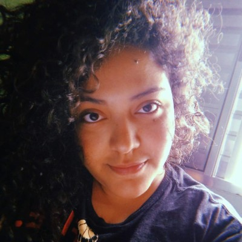
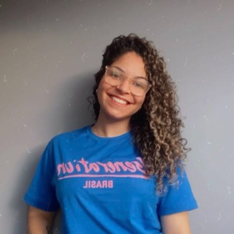
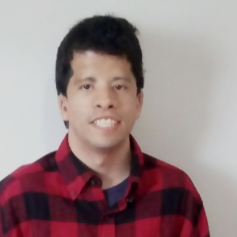
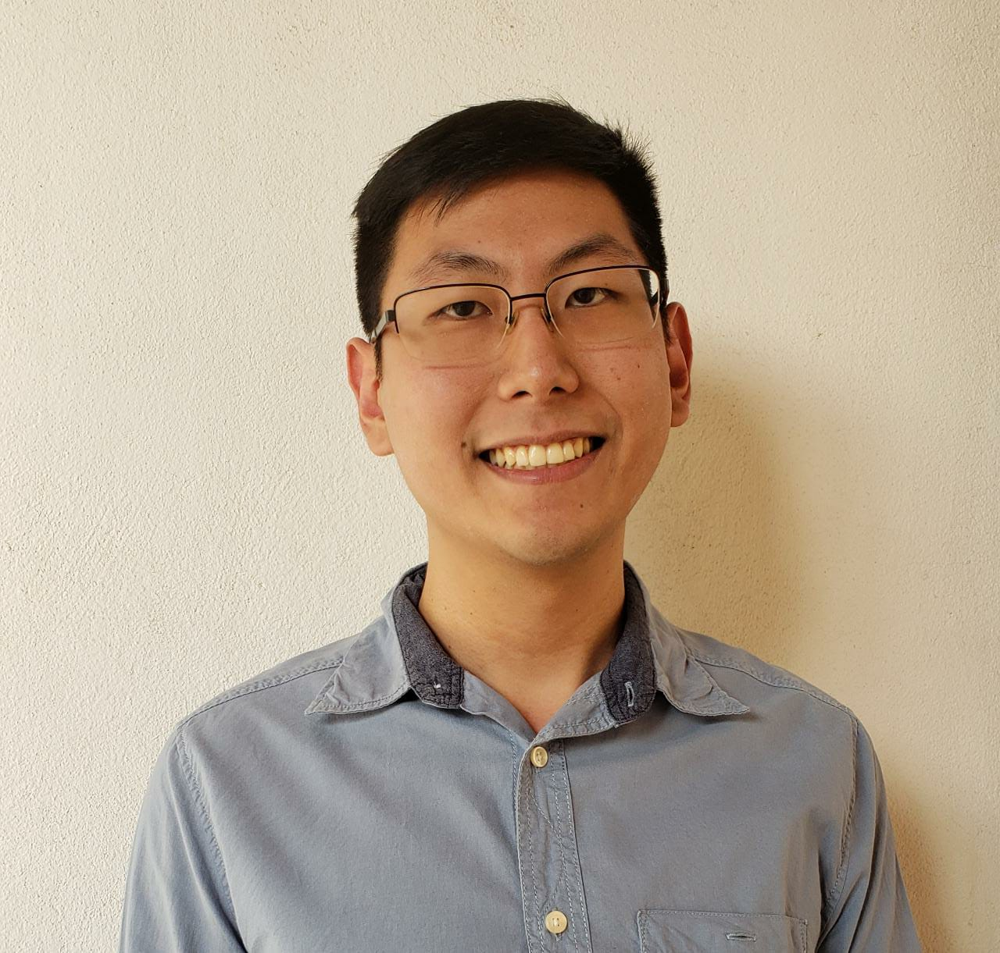

        

# A plataforma que iguala o seu conhecimento:

[ Acesso a nossa rede social](https://edq-ensino.netlify.app/): https://edq-ensino.netlify.app/ 
 
Trello: https://trello.com/invite/b/5PRSkUge/82ae5db246eebbcf84d7d95d8a6f3fc3/template-kanban

## 🎯 O PROJETO

Esse projeto surgiu pelo desafio proposto pela <a href='https://brazil.generation.org/'>Generation Brasil</a>, onde os alunos deveriam pensar em uma rede social ou e-commerce que auxiliasse na resolução do Objetivo de Desenvolvimento Sustentável (ODS) 4 da ONU. Assim os grupos desenvolveram um projeto que abrange o Front-end, Back-end e Banco de dados com suas respectivas tecnologias.

## 💡 IDEIA

        

            A EDQ surgiu devido a grande discrepância que temos no sistema de ensino brasileiro, onde um aluno de ensino público acaba saindo com defasagens em relação a um aluno de ensino privado. Sabendo dessa problemática, resolvemos criar uma plataforma onde os alunos tanto de ensino publico quanto privado possam utilizar para aprender, nivelando por cima todo o conhecimento e podendo gerar uma disputa justa e igualitária na hora dos vestibulares e no mercado de trabalho. 
            Na plataforma ofereceremos o melhor conteúdo e com os melhores professores para um ensino padrão para todos, para que isso ocorra permitiríamos o acesso gratuito por alunos de ensino público, com propagandas e patrocínios, e pago para estudantes do ensino privado.
        

        

            
        

## 💻 TECNOLOGIAS APLICADAS

 

Esse projeto pode englobar todos os conhecimentos técnicos adquiridos durante o bootcamp da Generation Brasil, desde a criação de uma API REST com sua documentação e deploy até a estruturação do Front-end com o Figma, realização com o Framework Angular e liberando para web com o netlify.
Nossa plataforma é completamente responsiva, mantendo 2 CRUDs completos, diferenciação de usuários e um consumo de vídeos. Todos esses detalhes você pode observar melhor no nosso link do ínicio da página!

## 📓 ORGANIZAÇÃO

Além de todas as habilidades técnicas, contamos também com as metodologias ágeis: Kanban, Scrum e Smart. 
Então, sempre em nossas dailies, nós fazíamos um alinhamento de atividades e expectativas de entrega.

Embora sejamos todos desenvolvedores na nossa equipe, sempre mantemos uma rotatividade de papéis e a responsabilidade pessoal de realizar e entregar suas atividades até a data e hora definida.

Até como a própria SMART cita, as atividades são específicas, mensuráveis, alcançáveis, relevantes e com prazo definido.

No dia a dia utilizamos o git flow para desenvolvimento.

A utilização do kanban dentro da nossa equipe se deu através do uso da ferramenta trello,levando em consideração as atividades ‘to do’, ‘doing’ e ‘done’.

## MEMBROS

    

    <h3>Alexsander Sousa<h3>
     
    <a href="https://github.com/samssousa" class="text-center fonte-texto">Desenvolvedor Full-stack</a>
    

        

    <h3>Andára Finot<h3>
     
    <a href="https://github.com/adrfnt" class="text-center fonte-texto">Desenvolvedor Full-stack</a>
     

            

    <h3>Juliana Ribeiro<h3>
     
    <a href="https://github.com/JuRibeiro" class="text-center fonte-texto">Desenvolvedor Full-stack</a>
    

            

    <h3>Lorrans Facca<h3>
     
    <a href="https://github.com/lorransfacca" class="text-center fonte-texto">Desenvolvedor Full-stack</a>
    

            

    <h3>Matheus Barbosa<h3>
     
    <a href="https://github.com/Matheus094-tech" class="text-center fonte-texto">Desenvolvedor Full-stack</a>
    

            

    <h3>Renato Nakamura<h3>
     
    <a href="https://github.com/Renato-Nakamura" class="text-center fonte-texto">Desenvolvedor Full-stack</a>
    

